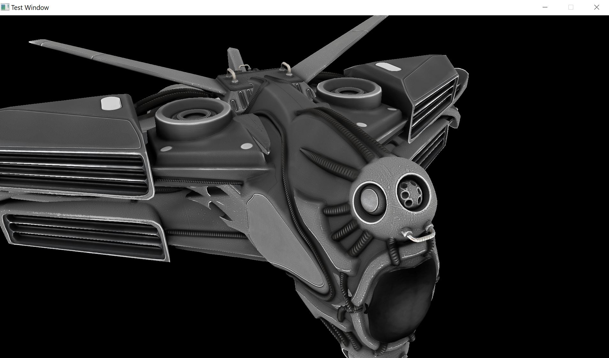
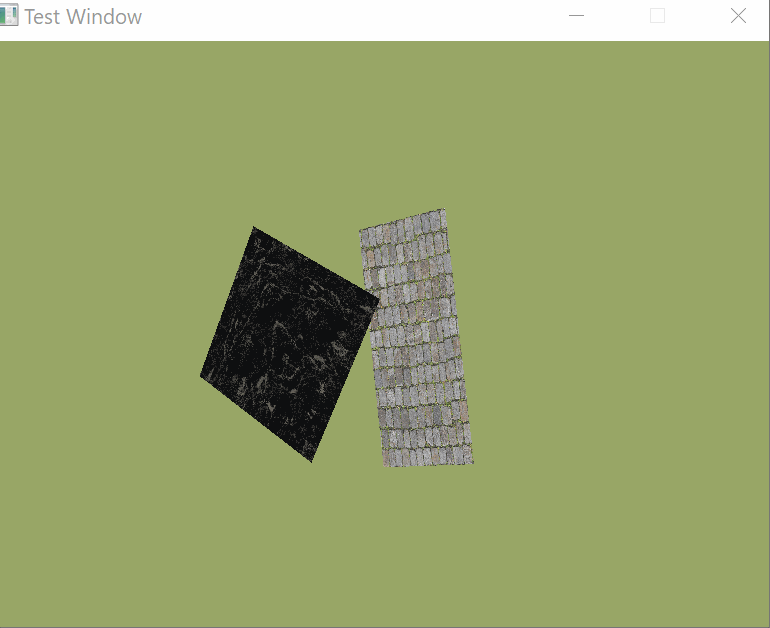
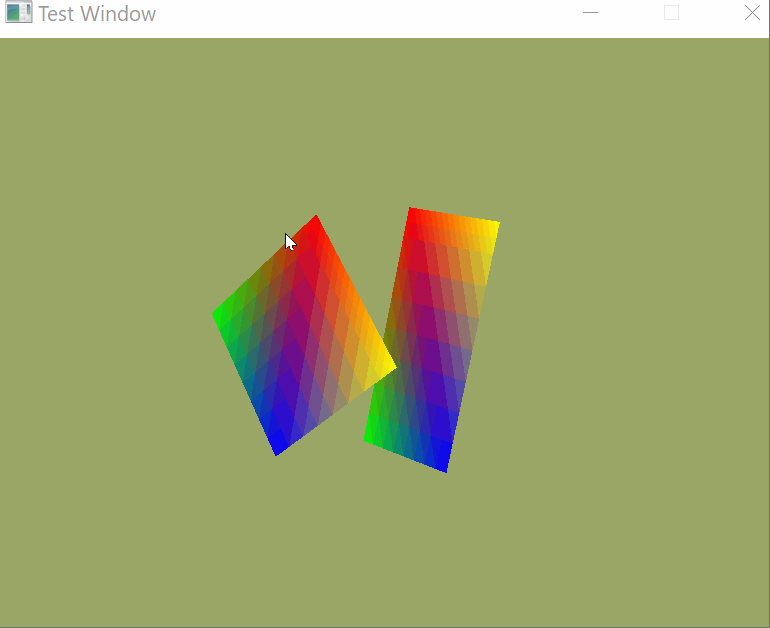

# Vulkan Renderer

C++ Vulkan renderer built from scratch to dynamically load models from obj files together with respective textures.

This Vulkan Renderer features the following functionality:
* Texture loading
* Obj model loading
* Dynamic model loading
* Dynamic View Projection transformations
* Converting GLSL shaders to SPIRV
* Game loop
* Multiple Subpases
* Multiple descriptor sets 
* Dynamic buffers 
* Depth buffer based on vertex distance to camera
* Semaphores and fences to ensure parallel correctness

# Building and running

## Dependencies
* vulkan-1.lib
* glfw3.lib
* assimp-vc140-mt.lib
* Vlkan 1.2.141.2 includes
* GLM includes (in this repo)
* ASSIMP includes (in this repo)
* GLFW includes (in this repo)
* stb_image.h (in this repo)

# Screenshots

## Model loaded
* https://free3d.com/3d-model/intergalactic-spaceship-in-blender-28-eevee-394046.html

## Model Loading

## Texture Loading

## Simple Colours

